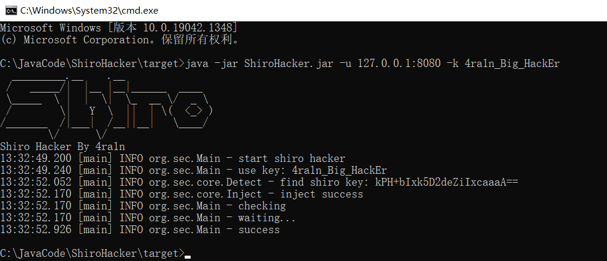

# ShiroHacker

## ⚠️免责声明
在原有的协议中追加以下内容：

本项目禁止进行未授权商业用途

本项目禁止二次开发后进行商业用途

本项目仅面向合法授权的企业安全建设行为，在使用本项目进行检测时，您应确保该行为符合当地的法律法规，并且已经取得了足够的授权

如您在使用本项目的过程中存在任何非法行为，您需自行承担相应后果，我们将不承担任何法律及连带责任

在使用本项目前，请您务必审慎阅读、充分理解各条款内容，限制、免责条款或者其他涉及您重大权益的条款可能会以加粗、加下划线等形式提示您重点注意。 除非您已充分阅读、完全理解并接受本协议所有条款，否则，请您不要使用本项目。您的使用行为或者您以其他任何明示或者默示方式表示接受本协议的，即视为您已阅读并同意本协议的约束

## 简介

什么是`ShiroHacker`

是否能够创造一个只属于你一人的`Shiro`反序列化漏洞：只要你挖到，从此以后再不会有其他人能够挖到这个洞

其实这也是一种修复方案

（该工具只针对于`SpringBoot/SpringMVC`配合`Shiro`的情况，这也是最广泛的情况）

## 使用

可以使用配套测试环境：https://github.com/EmYiQing/ShiroEnv

或者直接下载打包好的测试环境：https://github.com/EmYiQing/ShiroEnv/releases/download/1.0/shiro.jar

（启动后访问：http://127.0.0.1:8080）

命令：`java -jar ShiroHacker.jar -u [TARGET_URL] -k [YOUR_NEW_KEY]`

## 注意

1. 请提供16位长度的`Key`否则会影响到服务端正常的业务逻辑（不提供会使用默认的）
2. Payload仅可用于较新版本的`SpringBoot`中（例如2.6.0）
3. 使用该工具有可能会导致服务端业务逻辑出问题，真实环境**慎用**

## 原理

和普通`Shiro`工具一样，本工具会首先扫描`key`并输出

然后会用`Shiro`原生反序列化链`CB1`构造`Payload`打过去

这个`Payload`的逻辑是反射修改服务端的`Key`，需要修改三处地方

- AbstractRememberMeManager.DEFAULT_CIPHER_KEY_BYTES
- CookieRememberMeManager.encryptionCipherKey
- CookieRememberMeManager.decryptionCipherKey

只修改第一处不会生效，需要获取`Spring`的`Context`拿到`CookieRememberMeManager`的`Bean`修改后两处

## 感谢

感谢天下大木头师傅提供帮助：https://github.com/KpLi0rn

提出该技术的文章：https://xz.aliyun.com/t/9450

## 免责申明

**未经授权许可使用`ShiroHacker`攻击目标是非法的**

**本程序应仅用于授权的安全测试与研究目的**

